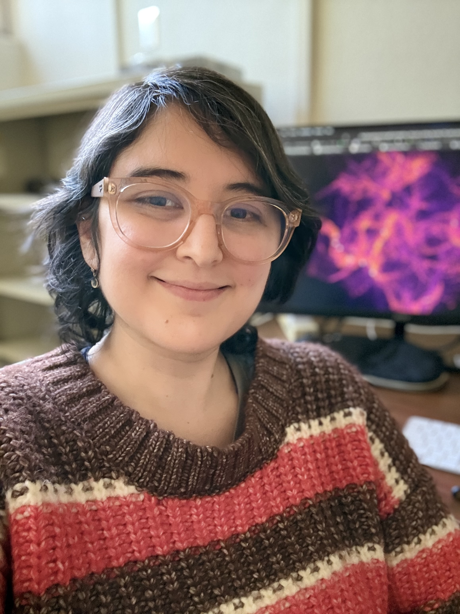

::: {#top .hero-section}
::: {.hero-grid}

::: {.profile-wrap}
{.profile-portrait}
:::

::: {}

 Star Formation • ISM • Numerical simulations

Griselda Arroyo-Chávez

Postdoctoral Research Associate · Steward Observatory · University of Arizona

I am a postdoctoral researcher in astrophysics working on star formation, the interstellar medium, filamentary structure, angular momentum transport, and synthetic observations. My work combines theory, numerical simulations, and comparisons with observations to study how structure and kinematics emerge across scales.

  <a href="research.qmd" class="btn-sand">Explore Research</a>
  <a href="publications.qmd" class="btn-outline-desert">Publications</a>
  <a href="contact.qmd" class="btn-outline-desert">Contact</a>

:::

:::
:::

::: {.timeline-horizontal-section}

## Academic Path
A brief view of my academic path and current research stage.

::: {.timeline-horizontal}

::: {.timeline-horizontal-item}
::: {.timeline-horizontal-dot}
:::
::: {.timeline-horizontal-date}
2013–2018
:::
::: {.timeline-horizontal-card}
::: {.timeline-horizontal-title}
BSc in Physics
:::
::: {.timeline-horizontal-place}
Universidad Veracruzana · Veracruz, Mexico
:::
::: {.timeline-horizontal-supervisor}
**Supervisors:** Dr. Alejandro Cruz Osorio and Prof. Cuauhtemoc Campuzano Vargas 
:::
::: {.timeline-horizontal-text}
Simulations of neutron star collapse
:::
:::
:::

::: {.timeline-horizontal-item}
::: {.timeline-horizontal-dot}
:::
::: {.timeline-horizontal-date}
2018–2024
:::
::: {.timeline-horizontal-card}
::: {.timeline-horizontal-title}
MSc and PhD in Astrophysics
:::
::: {.timeline-horizontal-place}
Institute of Radioastronomy and Astrophysics (IRyA), UNAM · Mexico
:::
::: {.timeline-horizontal-supervisor}
**Supervisor:** Prof. Enrique Vázquez-Semadeni
:::
::: {.timeline-horizontal-text}
Evolution and redistribution of angular momentum in molecular clouds
:::
:::
:::

::: {.timeline-horizontal-item}
::: {.timeline-horizontal-dot}
:::
::: {.timeline-horizontal-date}
2024–present
:::
::: {.timeline-horizontal-card}
::: {.timeline-horizontal-title}
Postdoctoral Research Associate
:::
::: {.timeline-horizontal-place}
Steward Observatory · University of Arizona
:::
::: {.timeline-horizontal-supervisor}
**Supervisor:** Dr. Shuo Kong
:::
::: {.timeline-horizontal-text}
Angular momentum transport in interstellar filaments
:::
:::
:::

:::
:::

::: {.simulations-block}
## Interactive Simulations

You can move around! Use your mouse to navigate the simulation by zooming and dragging. Explore the control panel and change the parameters to your liking!

::: {.viz-grid}
::: {.viz-card}
### Filamentary Structures

<iframe
  src="interactive/box_mhd_grav_cooling_3d_arepo_174_point_cloud.html"
  title="Interactive K3D visualization of filament structure"
  loading="lazy"
  allowfullscreen>
</iframe>

Check out the kind of simulations I do! This interactive rendering shows the filamentary gas structure in a magnetized, self-gravitating simulation of giant molecular cloud and filament formation in a 256pc box. It highlights the spatial distribution of dense gas and the emergence of elongated structures across the computational domain.

:::

::: {.viz-card}
### Velocity Field with Gravity

<iframe
  src="interactive/velocity_vectors_with_gravity.html"
  title="Interactive K3D visualization of velocity field"
  loading="lazy"
  allowfullscreen>
</iframe>

Shown here is a filament with SPH particles colored by density, along with velocity vectors and a pair of sinks represented by the large white spheres. This is a simulation with turbulence and gravity. Do you see any rotation around the sinks?

:::

::: {.viz-card}
### Velocity Field Without Gravity

<iframe
  src="interactive/velocity_vectors_without_gravity.html"
  title="Interactive K3D visualization of magnetic field"
  loading="lazy"
  allowfullscreen>
</iframe>

Here is another filament from my gravity-free simulation, just turbulence! The color represents density, and white arrows indicate the velocity of some SPH particles. What happens if I remove gravity? Do you no longer see any rotation?

:::

::: {.viz-card}
### Velocity Field With Magnetic Field

<iframe
  src="interactive/velocity_vectors_magnetic.html"
  title="Interactive K3D visualization of sink environment"
  loading="lazy"
  allowfullscreen>
</iframe>

Here is the last filament with particles colored by density and velocity vectors, but this time, I've added a magnetic field! Is it really rotating around its principal axis?

:::

:::
:::

::: {.back-to-top-block}
::: {.back-to-top-wrap}
[Back to top](#top){.back-to-top-btn}
:::
:::