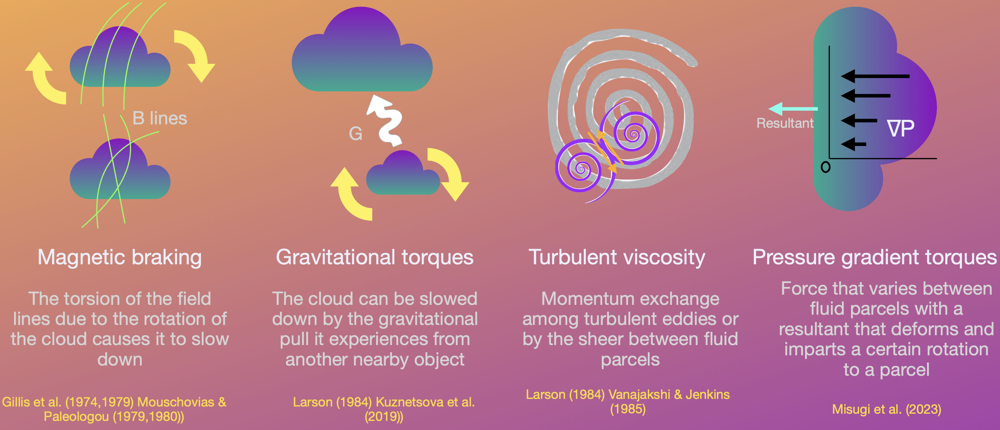
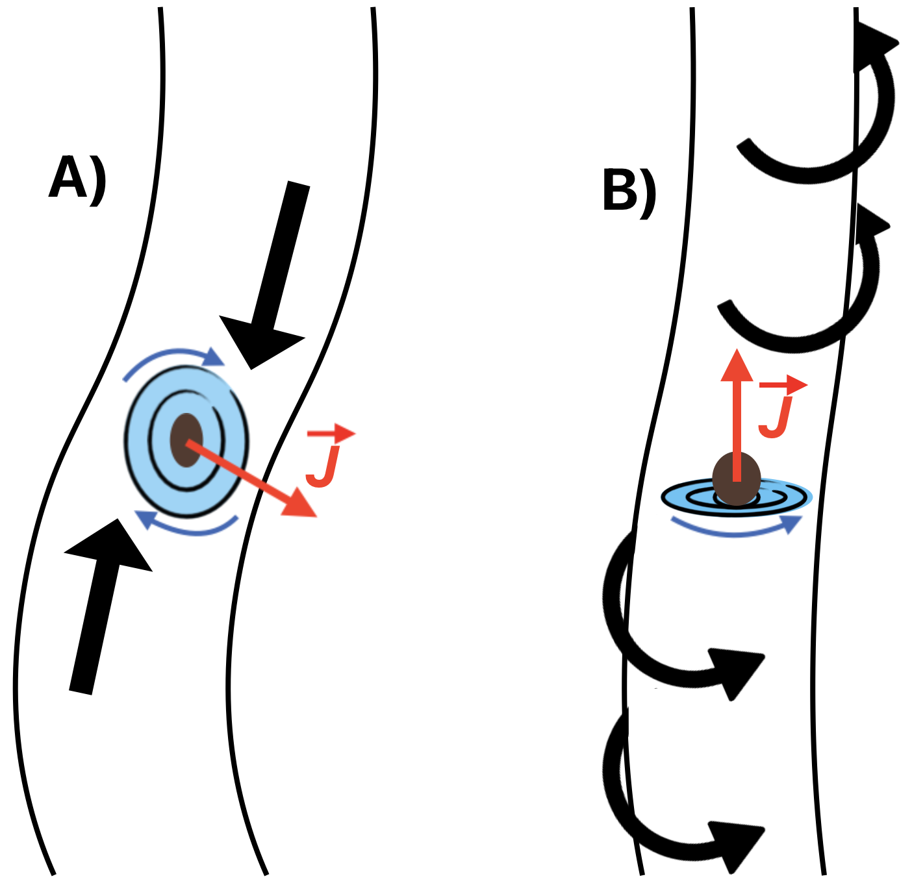
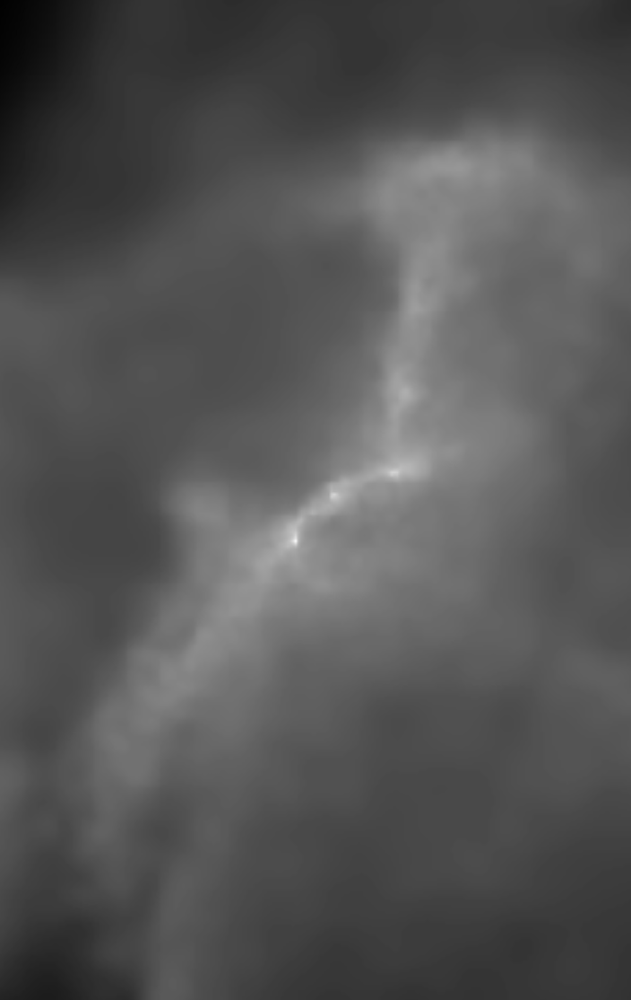

<button id="mini-prev" type="button" style="position:relative; z-index:40; width:54px; height:54px; border-radius:999px; border:1px solid rgba(216,190,138,0.24); background:rgba(14,27,50,0.82); color:#f5efe2; font-size:2rem; cursor:pointer;">‹</button>

Angular Momentum Transport in Molecular Clouds
<button type="button" class="topic-btn" data-topic="clouds" style="display:block; width:max-content; min-width:134px; margin:0 auto; padding:0.78rem 1rem; border-radius:999px; border:1px solid rgba(216,190,138,0.34); background:linear-gradient(135deg, rgba(216,190,138,0.97), rgba(232,208,164,0.93)); color:#08111f; font-size:0.96rem; font-weight:600; cursor:pointer; box-shadow:0 8px 16px rgba(0,0,0,0.16);">Open me!</button>

Active Torques in Molecular Clouds
<button type="button" class="topic-btn" data-topic="torques" style="display:block; width:max-content; min-width:114px; margin:0 auto; padding:0.62rem 0.8rem; border-radius:999px; border:1px solid rgba(216,190,138,0.34); background:linear-gradient(135deg, rgba(216,190,138,0.94), rgba(232,208,164,0.90)); color:#08111f; font-size:0.82rem; font-weight:600; cursor:pointer; box-shadow:0 8px 16px rgba(0,0,0,0.14);">Open me!</button>

Angular Momentum Transport in Filaments
<button type="button" class="topic-btn" data-topic="filaments" style="display:block; width:max-content; min-width:114px; margin:0 auto; padding:0.62rem 0.8rem; border-radius:999px; border:1px solid rgba(216,190,138,0.34); background:linear-gradient(135deg, rgba(216,190,138,0.94), rgba(232,208,164,0.90)); color:#08111f; font-size:0.82rem; font-weight:600; cursor:pointer; box-shadow:0 8px 16px rgba(0,0,0,0.14);">Open me!</button>

Synthetic Observations
<button type="button" class="topic-btn" data-topic="synthetic" style="display:block; width:max-content; min-width:102px; margin:0 auto; padding:0.52rem 0.68rem; border-radius:999px; border:1px solid rgba(216,190,138,0.34); background:linear-gradient(135deg, rgba(216,190,138,0.92), rgba(232,208,164,0.88)); color:#08111f; font-size:0.74rem; font-weight:600; cursor:pointer; box-shadow:0 8px 16px rgba(0,0,0,0.12);">Open me!</button>

<button id="mini-next" type="button" style="position:relative; z-index:40; width:54px; height:54px; border-radius:999px; border:1px solid rgba(216,190,138,0.24); background:rgba(14,27,50,0.82); color:#f5efe2; font-size:2rem; cursor:pointer;">›</button>

<button id="research-close-bottom" type="button" style="display:block; margin:0 auto; padding:0.7rem 1rem; border-radius:999px; border:1px solid rgba(216,190,138,0.24); background:rgba(255,255,255,0.04); color:#f5efe2; font-size:0.92rem; font-weight:600; cursor:pointer;">Close</button>

