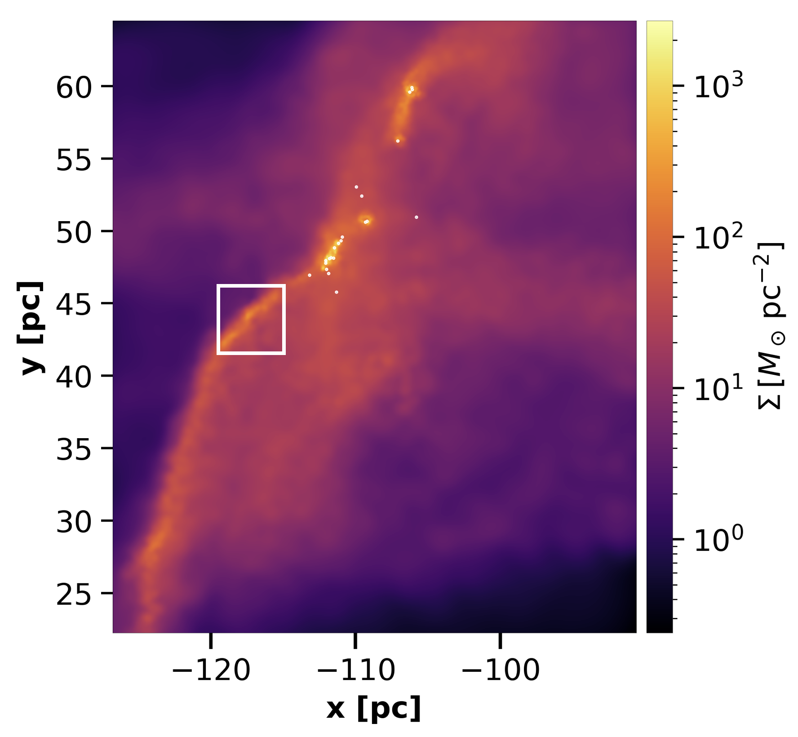

## Research Overview

::: {.research-grid}

::: {.research-item}
### Filamentary Structure

{.research-img}

Toggle

I study how filamentary structures emerge, evolve, and channel mass in star-forming environments.

A major focus is understanding how filaments connect large-scale cloud dynamics to the formation of dense structures and embedded objects.

This includes the analysis of geometry, kinematics, accretion flows, and the relation between filamentary structure and the broader dynamical state of molecular clouds.

:::

::: {.research-item}
### Angular Momentum Transport

{.research-img}

Toggle

My work explores how angular momentum is acquired, redistributed, and transported across scales during cloud collapse and star formation.

I am particularly interested in the role of filamentary flows, turbulent motions, gravity, and magnetic fields in shaping the angular momentum budgets of dense gas and forming objects.

:::

::: {.research-item}
### Synthetic Observations

{.research-img}

Toggle

I use synthetic observations to connect numerical simulations with observational diagnostics, including continuum emission and molecular line tracers.

This helps bridge theoretical models with measurable quantities, allowing a more direct comparison between simulations and observed structures in the interstellar medium.

:::

::: {.research-item}
### Numerical Methods & Simulations

{.research-img}

Toggle

My research relies on numerical simulations to study the interstellar medium and star-forming systems in dynamic, non-isolated environments.

I work with simulation analysis, visualization, post-processing, and radiative transfer workflows to investigate how structure and kinematics emerge across scales.

:::

:::